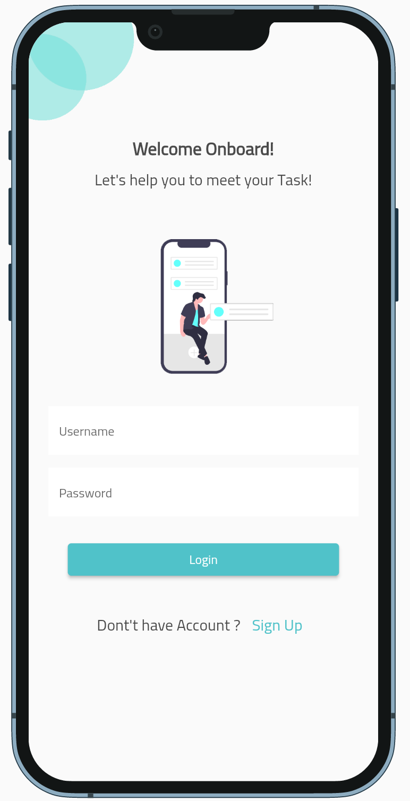
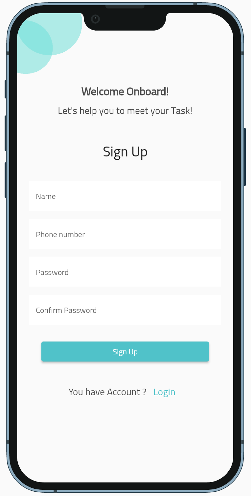
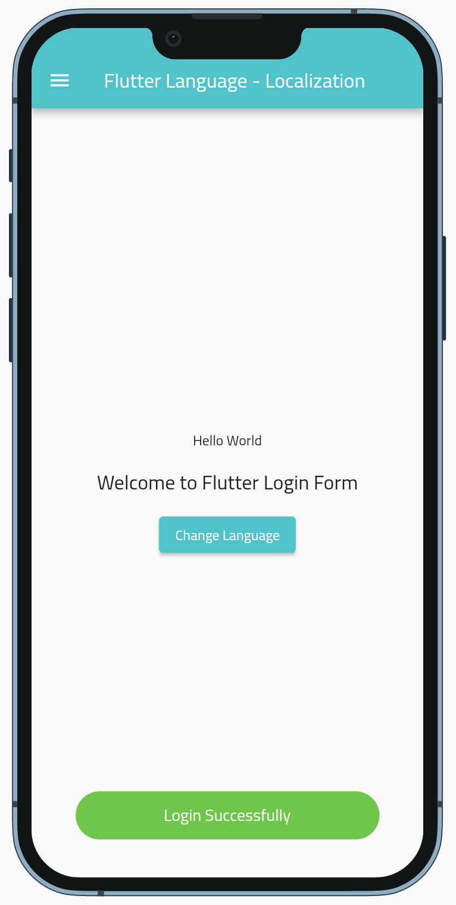
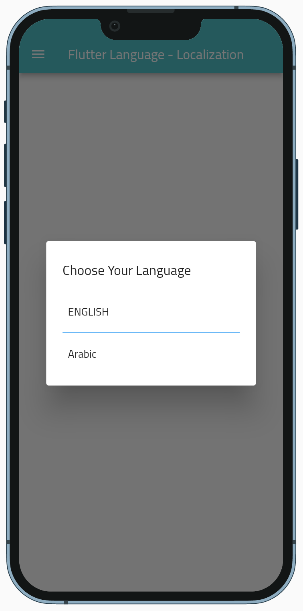
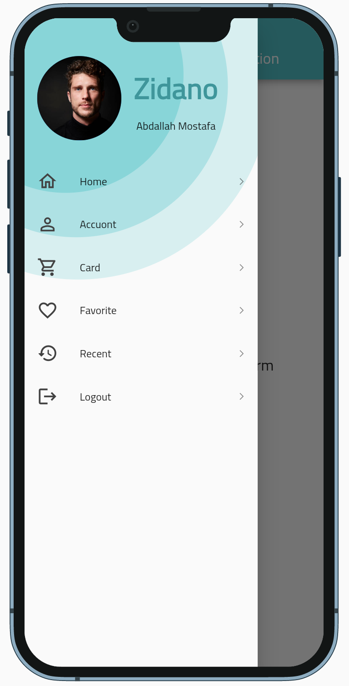
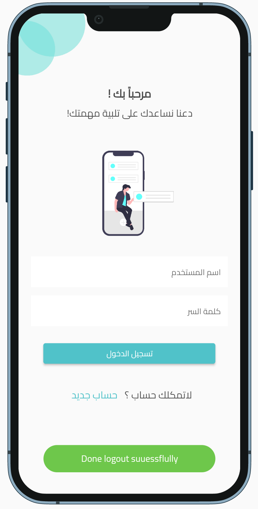
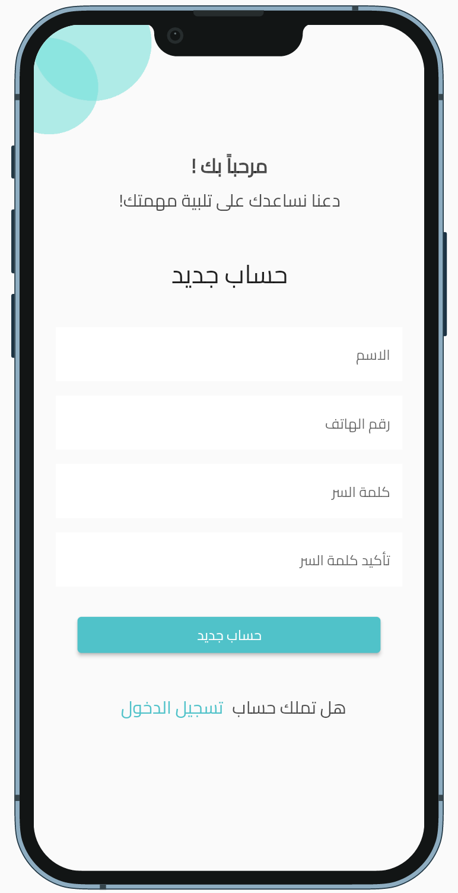
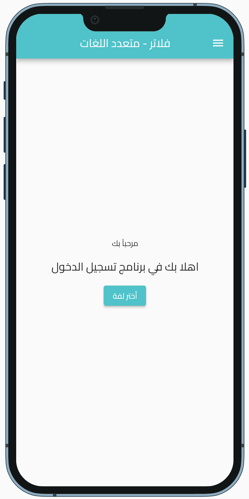
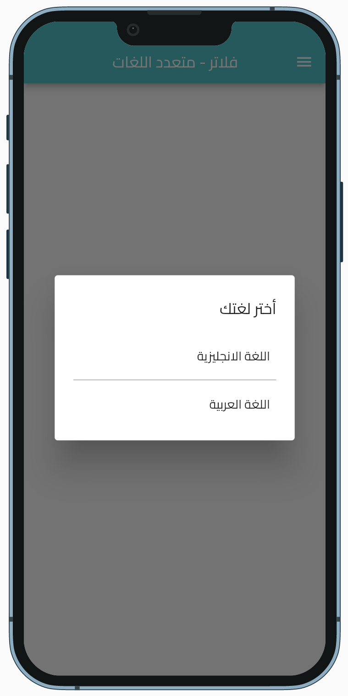
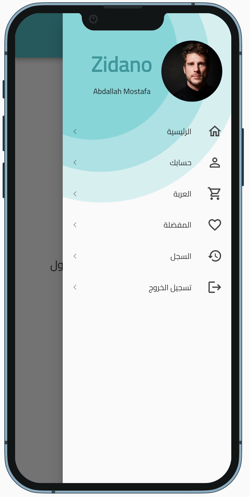

# Login & Signup Form 

This project is a login and registration form to use in future applications because it is easily adjustable and is suitable for most applications and has nice features, rather than building it every time I need it.

## Getting Started

Features:
1. useing mvc pattern
2. support mulit language (localeization) (ar - en)
3. uses getx as (state management)
4. it contains native splash screen
5. modern & simple design
6. you can edit eny thing simpley (clean code) 
7. uses sharedpreferences to save the selected language and login state

## Screenshots

<h4>English</h4>

<h4>Arabic</h4>

